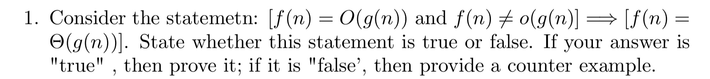
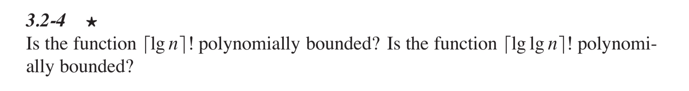
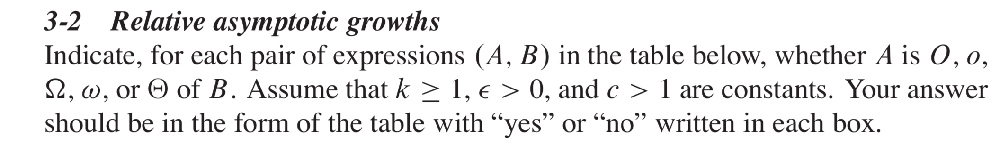
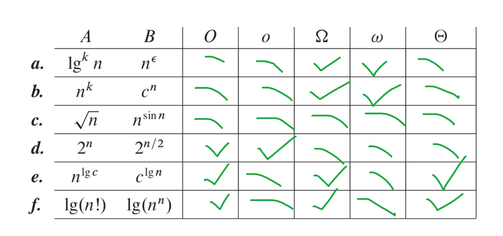
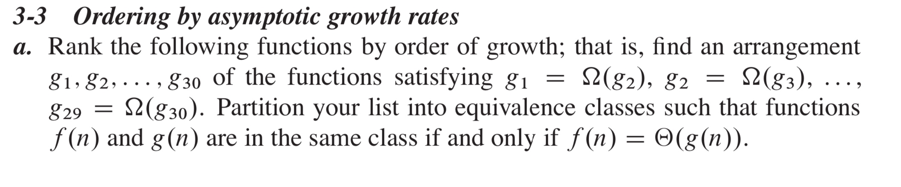
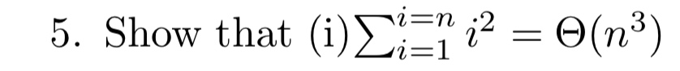

# Assigment 1
# Jiadao Zou --- jxz172230
## Q1:

> The answer is True. 
Since we know that $f(n)=O(g(n))$ and $f(n)\neq o(g(n))$:
$$
\lim\limits_{n\rightarrow\infty}{{f(n)}\over{g(n)}}=c<\infty \textrm{ also }\neq 0   
$$
Since the algorithms' cost would never decrease with the working load goes up, we have :
$$
\lim\limits_{n\rightarrow\infty}{{f(n)}\over{g(n)}}\in (0,\infty)
$$
From above, we know that the limitation ratio must lays within 0 and $\infty$, which holding both tight upper bound and tight lower bound.

## Q2:

> - If a function $f(n)$ is polynomially bounded, then there must be constant values $c,k,n_0$, such that for all $n \geq n_0$, $f(n)\leq cn^k$. Hence, $\lg(f(n))\leq k\lg cn \leq kc\lg n$, therefore, we know that $\lg (f(n))=O(\lg n)$.   
> 
> - To the other side: if we know that $\lg (f(n))=O(\lg n)$, we could conclude that $f(n)$ is polynomially bounded.  
>
> From above, we know that proving a function $f(n)$ is polynomially bounded is equivalent to prove that $\lg(f(n))=O(\lg(n))$.
> - Function $\lceil \lg n \rceil!$
>   - First we concern about $\lg(n!)$'s complexity:
>       - According to Stirling's approximation:
          $$
          \lg(n!) = \lg(\sqrt{2\pi n} ({n \over e})^n (e^{\alpha_n}))        \\
          = \lg(\sqrt{2\pi n} ({n \over e})^n (1+\Theta({1 \over n})))      \\
            = \Theta(\sqrt{n})+\Theta(n \lg n) + \Theta({1 \over n})      \\
            = \Theta(n \lg n)
          $$
 >   - Second, we want to show $\lceil \lg n \rceil = \Theta(\lg n)$ :
        - $\lceil \lg n \rceil \leq \lg n$
        - $\lceil \lg n \rceil < \lg n + 1 \leq 2\lg n$ for $\forall n \geq 2$   
    
>   - Third, to $\lg (\lceil \lg n \rceil !)$, we could take $\lceil \lg n \rceil$ as $n$ in previous prove :      $$
    \lg (\lceil \lg n \rceil !) = \Theta(\lceil \lg n \rceil \lg \lceil \lg n \rceil)       \\
        = \Theta(\lg n (\lg\lg n))        \\
        = \omega(\lg n)                 \\
        \neq O(\lg n)$$  **So, $\lceil \lg n \rceil!$ is not polynomially bounded.**    
> - Function $\lceil \lg \lg n \rceil!$, the steps are all the same:
>   - First, we have to know that any polylogarithmic function grows slowly than any positive polynomial function
>       - Suppose for constants $a,b > 0$, $\lg^b n=o(n^a)$. 
>       - Substitute $n$ with $\lg n$, $b$ with $2$ and $a$ with $1$: $\lg^2(\lg n) = o(\lg n)$
>       $$
        \lg(\lceil \lg \lg n \rceil!) = \Theta(\lceil \lg \lg n \rceil \lg\lceil \lg \lg n \rceil)      \\
        = \Theta((\lg \lg n)(\lg \lg \lg n))        \\
        = o((\lg \lg n)^2)      \\
        = o(\lg^2 (\lg n))      \\
        = o(\lg n)
        $$**So, $\lceil \lg \lg n \rceil!$ is polynomially bounded.**   

## Q3

> 
> a. $\lg^k = o(n^\epsilon)  \Longrightarrow \omega(\lg^k n) = n^\epsilon, \omega \rightarrow \Omega, \omega \rightarrow \bar{o}\wedge \bar{O} \Longrightarrow \bar{\Theta}$.
> b. $n^k=o(c^n) \Longrightarrow \omega(n^k)=c^n, \omega \rightarrow \Omega, \omega \rightarrow \bar{o}\wedge \bar{O} \Longrightarrow \bar{\Theta}$.
> c. $sin$function changes periodically, so the relationship between those two function is undefined.
> d. $\lim\limits_{n \rightarrow \infty}{2^n \over {2^{n/2}}}=\lim\limits_{n \rightarrow \infty}(\sqrt2)^n = \infty$, which indicates $o(2^n)=2^{n/2}, o \rightarrow O, o \rightarrow \bar{\omega}\wedge \bar{\Omega} \Longrightarrow \bar{\Theta}$
> e. when $c=1$, $n^{\lg c}=n^0=1=c^{\lg n}=1^{\lg n}$, so $O,\Omega\Longrightarrow \Theta={\bar{o} \wedge \bar{\omega}}$
> f. $\lg(n!) = \Theta(n\lg n) \Longrightarrow \Theta(\lg n!)=n\lg n=\lg n^n$, so $O,\Omega\Longrightarrow \Theta={\bar{o} \wedge \bar{\omega}}$

## Q4

$$2^{2^{n+1}} > 2^{2^n} > (n+1)! > n! \Longleftarrow (n \neq \Theta(n^{n+1}e^{-n}))> e^n \Longleftarrow (e^n=2^n(e/2)^n=\omega (n2^n)) >        \\
n2^n > 2^n > ({3 \over 2})^n > (\lg n)^{\lg n} = n^{\lg \lg n}  \Longleftarrow (a^{\log_bc}=a^{\log_ba \cdot \log_ac}=c^{\log_ba})> (\lg n)! > n^3 >       \\
n^2 = 4^{\lg n} > n\lg n = lg(n!) > 2^{\lg n} = n > \sqrt n = (\sqrt 2)^{\lg n} \Longleftarrow \textrm{take log} >          \\
2^{\sqrt{2\lg n}} \Longleftarrow \textrm{take log} > \lg^2 n > \ln n > \sqrt{\lg n} >           \\
\ln \ln n \Longleftarrow (\lg 2^{\lg^*n}=\lg^*n \cdot \lg \ln \ln n=\omega(\lg^*n)) >                 \\
2^{\lg^*n} > \lg^*n = \lg^*(\lg n) \Longleftarrow (\lg^*(\lg n)=(\lg^*n)-1)>       
lg(lg^*)n > n^{1/\lg n} = 2 = 1$$
> - Most of the functions follow that:
>   - Exponential functions grow faster than polynomial functions, and the later grow faster than polylogarithmic functions
>   - The base of a logarithmic doesn't matter asymptotically, but the base of an exponential and the degree of a polynomial do matter.

## Q5

> Prove:
> suppose we have: $H(n) = { {\sum\limits_{i=1}^{i=n}i^2} \over {n^3} }$, also we know that $H(1)=1, H(2)={5 \over 8}, H(3)={12 \over 27}$, we could make a guess that $for \forall n, H(n) \in (0,\infty)$:
> Compare the following two expression, for $\exists integer \ n \in (0,\infty)$:
> - $H(n)={{\sum\limits_{i=1}^{i=n}i^2} \over {n^3}}$
> - $H(n+1)={{\sum\limits_{i=1}^{i=n}i^2 + (n^2+2n+1)} \over {n^3 + (3n^2+3n+1)}}$
> 
> **Obviously, the increase in numerator is less than the increase in denominator. So the $H(n)$ is monotonically decreasing.**
> - $H(n)$ won't be $0$ because the numerator is always larger than 0.
> - As well, $H(n)$ won't be $\infty$ because the denominator is always larger than 0.
 
    
        
