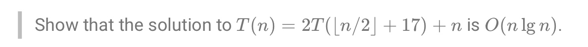
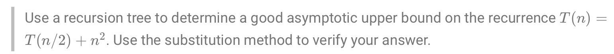
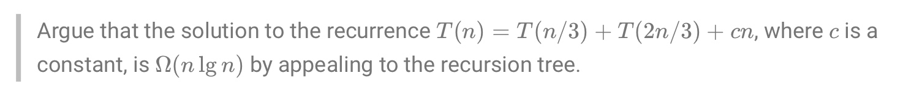
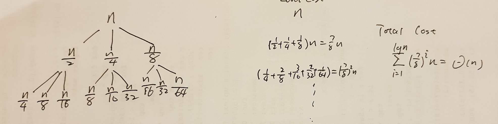
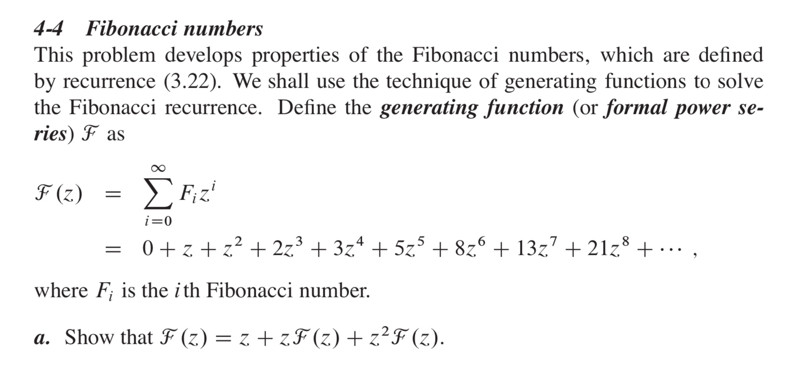
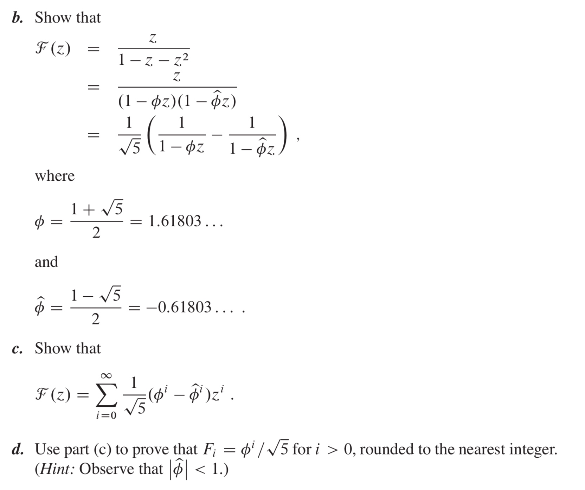
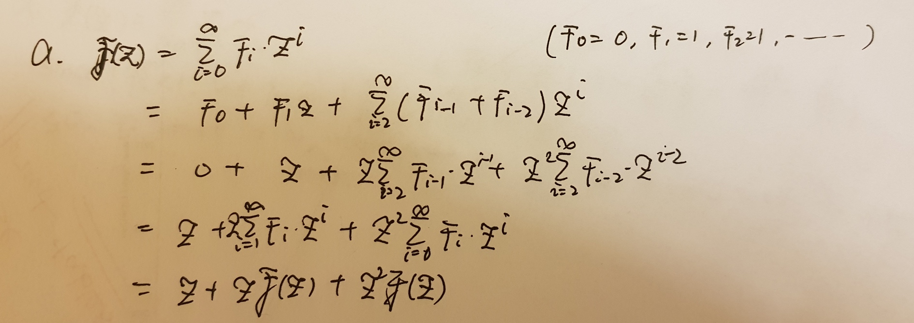
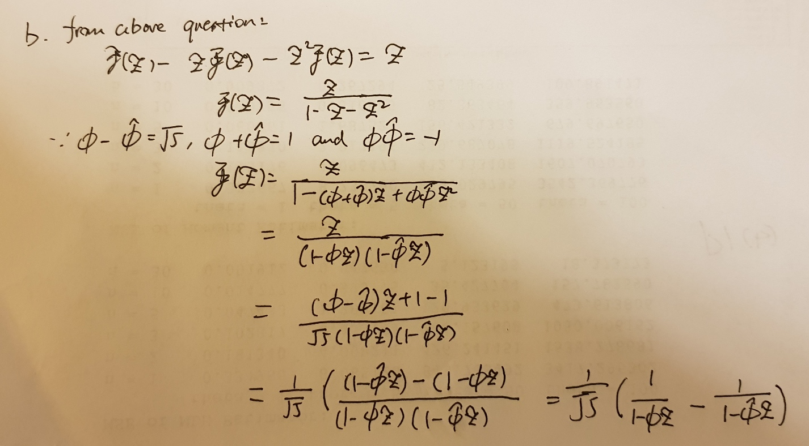
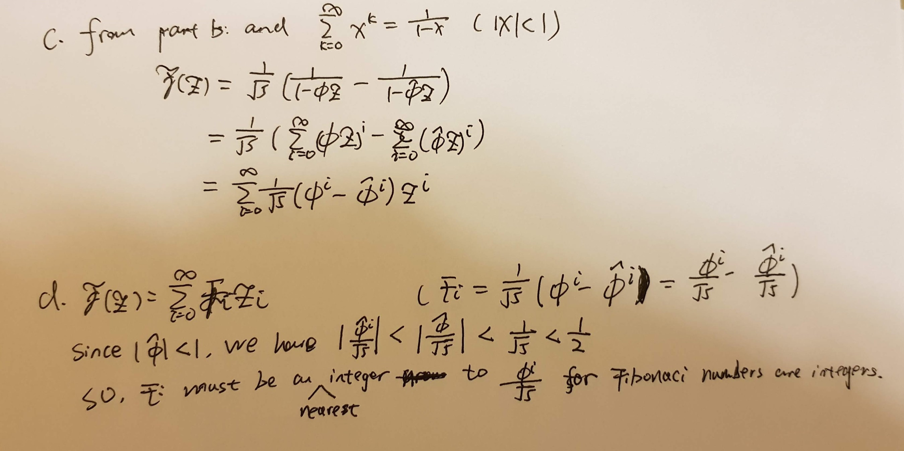

# Assigment 2
# Jiadao Zou --- jxz172230
## Q1:
### 4.3-6

Choose $n_1$ such that $n \geq n_1$ implies $n/2 + 17 \leq 3n/4$. We'll find $c,d$ such that $T(n) \leq cn \lg n -d$.
$$\begin{aligned}
T(n) & = 2T(\lfloor n/2 \rfloor)+17)+n        \\
    & \leq 2(c(n/2+17) \lg(n/2+17)-d)+n      \\
    & \leq cn \lg (n/2+17) + 34c\lg (n/2+17)-2d+n   \\
    & \leq cn \lg(3n/4)+34c \lg(3n/4)-2d+n      \\
    & = cn \lg n -d + cn\lg(3/4)+34c\lg(3n/4)-d+n
\end{aligned}$$ Take $c=-2/\lg(3/4)$ and $d=34$. Then we have $T(n) \leq cn\lg n -d+k\lg(n)-n$, where$k \in Integer$. Since $\lg(n)=o(n)$, there exists $n_2$ such that $n \geq n_2$ implies, $n \geq k\lg(n)$. Letting $n_0= \max\{n_1,n_2\}$, we have that $n \geq n_0$ implies $T(n) \leq cn \lg n -d$. Therefore, get proved.
  
  
### 4.3-9

First, we could use $2^k$ to replace $n$:
$$\begin{aligned}
T(n) = 3T(\sqrt{k/2})+\lg n        \\
T(2^k)=3T(2^{k/2})+k        \\
\end{aligned}$$ Now, use $S(k)$ as $T(2^k)$,$Integer \ k > 0$:
$$\begin{aligned}
S(k)=3S(k/2)+\lg k  
\end{aligned}$$     If we guess that, $S(k) \leq c \cdot k^{\lg 3}+dk$:
$$\begin{aligned}
S(k) &= 3S(k/2)+\lg k           \\
    &\leq 3[c(k/2)^{\lg 3}+d(k/2)]+k       \\
    &= {{3c}\over{2^{\lg3}}}k^{lg3}+({3\over {2}}d+1)k      \\
    &= C \cdot k^{lg3}+({3\over {2}}d+1)k       \\
    \textrm{If } d \leq -2:     \\
    S(k) &\leq C \cdot k^{\lg 3}+dk     \\
\end{aligned}$$     If we guess that, $S(k) \geq c \cdot k^{\lg 3}+dk$:
$$\begin{aligned}
S(k) &= 3S(k/2)+\lg k           \\
    &\geq 3[c(k/2)^{\lg 3}+d(k/2)]+k       \\
    &= {{3c}\over{2^{\lg3}}}k^{lg3}+({3\over {2}}d+1)k      \\
    &= C \cdot k^{lg3}+({3\over {2}}d+1)k       \\
    \textrm{If } d \geq -2:     \\
    S(k) &\geq C \cdot k^{\lg 3}+dk     \\
\end{aligned}$$     Thus, $S(k)=\Theta(k^{\lg 3})$, according to our transformation: $T(n) \rightarrow T(2^k)=S(k)$. Therefore we have $T(n)=\Theta((\lg n)^{\lg 3})$
  
  
## Q3
### 4.4-2

The tree has $\lg n+1$ levels, and the subproblem size of a node at depth $i$ is $n/2^i$. The total cost of the tree at depth is $({n \over{2^i}})^2 \cdot 1^i$: 
$$\begin{aligned}
T(n) &= \sum\limits_{i=0}^{\lg n}({n \over{2^i}})^2 \cdot 1^{\lg i} + \Theta(1)     \\
&< \sum\limits_{i=0}^{\infty}(1/4)^in^2 + \Theta(1)     \\
&= {{1-0} \over {1-1/4}}n^2+ \Theta(1)      \\
&= \Theta(n^2)
\end{aligned}$$ In the following, use substuition method to verify that $T(n) \leq cn^2$
$$\begin{aligned}
T(n) &\leq c(n/2)^2+n^2     \\
&= c{n^2 \over 4}+n^2       \\
&\textrm{if } ({c \over 4}+1) \geq c \Longrightarrow c \geq {3 \over 4}:    \\
&\leq cn^2
\end{aligned}$$
  
  
### 4.4-6

Examining the tree, we observe that the cost at each level of the tree is exactly $cn$. To find a lower bound on the cost of the algorithm, we need a lower bound on the height of the tree. The shortest simple path from root to leaf is found by following the left child at each node. Since we divide by 3 at each step, we see that this path has length $\log_3 n$, so the cost of the algorithm is $cn(\log_3n+1)≥cn \log_3n= {c \over \lg3}n \lg n=Ω(n \lg n)$.
  
  
## Problem 4-3
Give asymptotic upper and lower bounds for $T(n)$ in each of the following recurrences. Assume that $T(n)$ is constant for sufficiently small $n$. Make your bounds as tight as possible, and justify your answers.  

### b: $T(n)=3T(n/3)+n/\lg n$
According to M.T. $\textrm{a=3, b=3, }\log_ba=1, \textrm{ and }f(n)=n/\lg n $
At the first look, $f(n)=n/\lg n=2^{\lg n}/\lg n \Longrightarrow 0, \ when \ n \rightarrow \infty$. So, $f(n)=o(n^{log_ab})=O(n^{1-\epsilon}), \ \exists \epsilon: 1 >> \epsilon >0$. So we guess case 1 apply to this equation. In the following, I would try to prove this guess by deduction:
First, show that $T(n) \leq n \lg n$:
$$\begin{aligned}
T(n) &= 3T(n/3)+n/\lg n        \\
&\leq cn\lg n-cn\lg(3)+n/\lg n     \\
&= cn\lg n+({1 \over {\lg n}}-c\lg 3)n     \\
&\leq cn\lg n   
\end{aligned}$$ Now, we want to prove $T(n) \geq cn^{1-\epsilon}$ for every $\epsilon >0$:
$$\begin{aligned}
T(n) &= 3T(n/3)+n/\lg n        \\
&\geq 3c/3^{1-\epsilon}n^{1-\epsilon}+n/\lg n       \\
&=3^\epsilon cn^{1-\epsilon}+n/\lg n
\end{aligned}$$     Also, we want to show $T(n) \leq cn^{1-\epsilon}$ could be like that:
$$  3^\epsilon cn^{1-\epsilon}+n/\lg n \geq cn^{1-\epsilon}      \\
3^\epsilon +n^\epsilon /(c\lg n) \geq 1$$       Since $3^\epsilon>1$ and $\lg n =o(n^\epsilon)$. the above equation holds.
The function is soft Theta of n.  
  
### c: $T(n)=4T(n/2)+n^2\sqrt n$
Look at the equation: $T(n)=4T(n/2)+n^{5/2}$, according to M.T., we have $\textrm{a=4, b=2, }\log_ba=2, \textrm{ and }f(n)=n^{5/2}=\Theta(n^{2+\epsilon}) \textrm{ for } \epsilon=1/2$.  
So we look at case 3 regulation part 2:
$$af(n/b)=4(n/2)^2\sqrt{n/2}=n^{5/2}/\sqrt2 \leq cn^{5/2}, \ \forall c \in [{1 \over \sqrt2},1)$$       Since part 1 and part 2 are satisfied, case 3 is applied.   
   
### f: $T(n)=T(n/2)+T(n/4)+T(n/8)+n$

So, we want to prove the guess of recursion tree model.
First, to show that $T(n)=O(n)$ by substitution $T(n) \leq cn$:
$$\begin{aligned}
T(n) &= T(n/2)+T(n/4)+T(n/8)+n      \\
    &\leq   c{n \over2}+c{n \over4}+c{n \over8}+n     \\
    &=  ({7c\over 8}+1)n        \\
    &\leq cn, \ when \ c \geq 8         \\
\end{aligned}$$
Also, since $T(n) = T(n/2)+T(n/4)+T(n/8)+n \geq n$, thus $T(n)=\Omega(n)$.
So, we have $T(n)=\Theta(n)$

## Q4
>  

