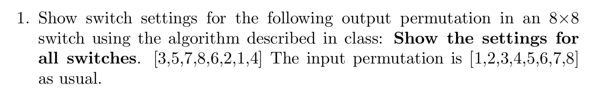
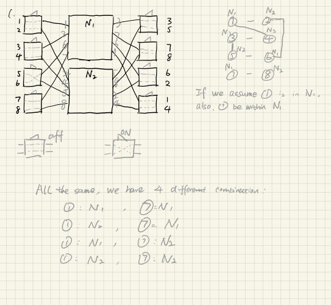
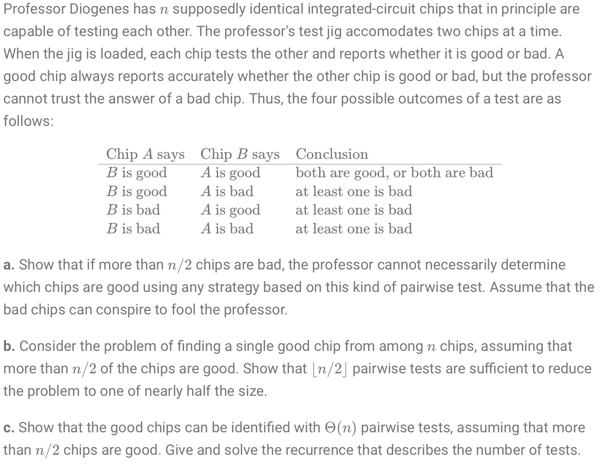
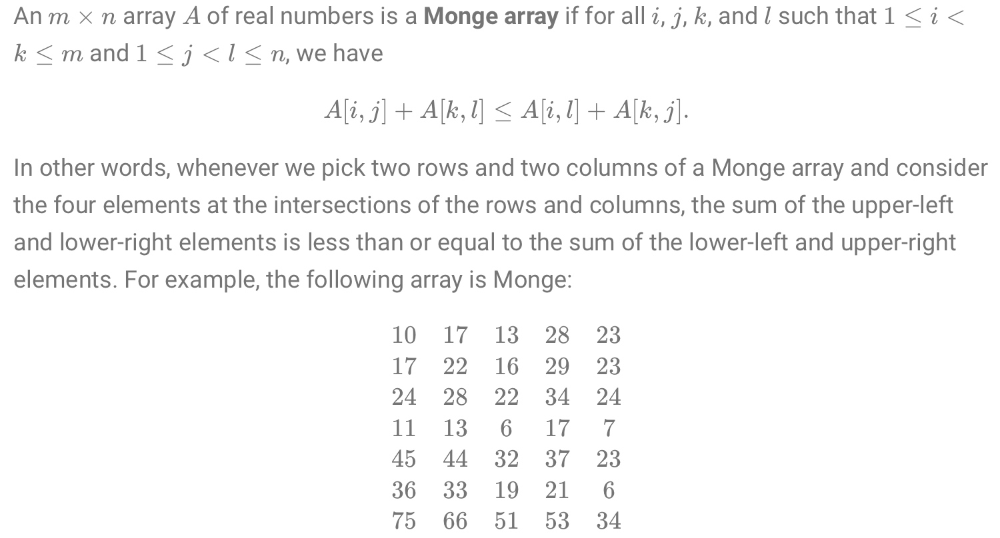
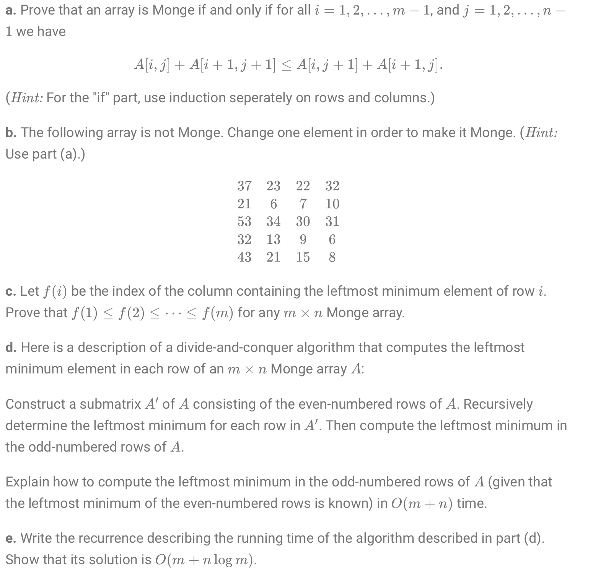
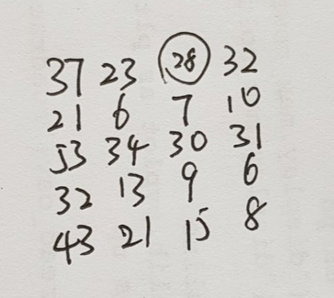
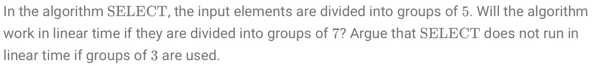
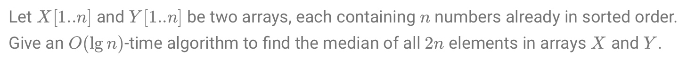
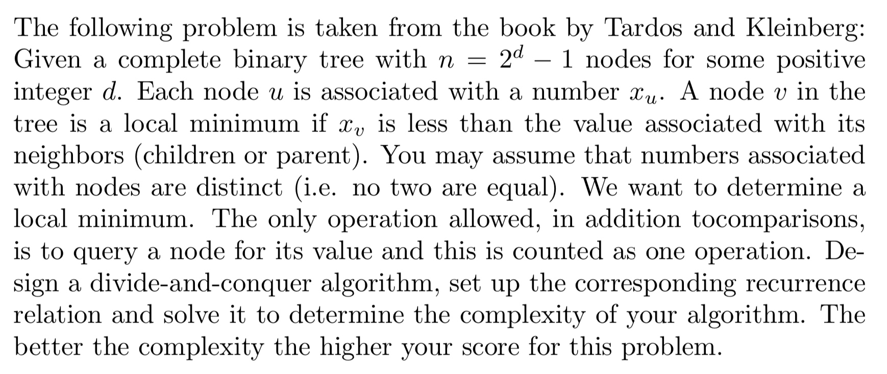

# Assignment 3
# Jiadao Zou --- jxz172230
## Q1
> 
  
  

## Q2 Problem.4-5
> 
  
a. 
- According to the question, we suppose if there are $m \in [0,{n \over 2})$ good chips and $n-m$ bad chips.  
- Since $m<n-m$, there are always a group of Good chips and a group of Bad chips of the same size.
- If such mirror situation happens, "Bad chips declare bad chips are 'Good' and good chips are 'Bad'. In the mean time, good chips would make a symmetric statement."
- Thus , it is impossible to know the truth from above information.

b.
- Arbitrarily pair up the chips. Only care about the pairs for which both chips says other is good. Since we have at least half of the chips are good, there will be at least one such pair, as well as, at least half of these pairs which both are good are actually good. Thus, dropping a chip in such pairs would never make bad chips be more than good ones.
- So, we just need to arbitrarily pick a chip from each pair (leave the last one alone, if the total number of remaining chips is odd) and use these chips to make up the sub-instance of the problem.
- If there is only 1 chip left, then it is the good chip. Else if there is no chip remaining, the chip we leave alone at the very beginning is the good one.
  
c.
- From b, we get a good chip. We could just use it to query every other chip. The recurrence to find it is $$T(n) \leq T(\lceil n/2 \rceil)+\lfloor n/2 \rfloor$$
- By Master Theorem, we have $T(n)=O(n)$. After finding a good chip, we make pair with the remaining $n-1$ ones, so the total number is $O(n)+(n-1)=\Theta(n)$  

## Q3 Problem.4-6
> 

a. 
- The "if" part is trivial, because according to the definition: $A[i,j]+A[k,l] \leq A[i,l]+A[k,j]$, we just need to take $k=i+1 \ and \ l=j+1$.
- Prove by induction:
    - Base case: $k=i+1$, assume it holds for $k=i+n$, and we want to show it works for $k+1=i+n+1$.
    - Deduction steps:
    $$\begin{aligned}
    A[i,j]+A[k,j+1] &\leq A[i,j+1]+A[k,j]       \\
    A[k,j]+A[k+1,j+1] &\leq A[k,j+1]+A[k+1,j]       \\
    \textrm{Put above two equation together}     \\
      A[i,j]+A[k,j+1] + A[k,j]+A[k+1,j+1] &\leq A[i,j+1]+A[k,j] + \\ & A[k,j+1]+A[k+1,j]     \\
       A[i,j]+A[k+1,j+1] &\leq A[i,j+1]+A[k+1,j]
   \end{aligned}$$
   
b. 

c. 
- Let $a_i \ and \ b_j$ be the leftmost minimal elements on row $a \ and \ b$, and we know $a<b$. We try to prove by contrary, assume $i > j$, thus we get]$$A[a,j]+A[b,i] \leq A[a,i]+A[b,j]$$
- But based on our assumption, $a_i, \ b_j$ is the minimal:
    - $A[a,i] \leq A[a,j]$ and $A[b,j] \leq A[b,i]$
    - $A[a,i]+A[b,j] \leq  A[a,j]+A[b,i]$
- Thus, we get $A[a,i]+A[b,j] =  A[a,j]+A[b,i]$
    - which implies "$A[a,j=A[a,i]$", so instead of $a_i, \ a_j$ is the left most minimal. Obviously, this is opposite to the assumption $i>j$.
        
d.
- From above, we assume $k_i$ is the index of the $i$-th row's leftmost minimum, then $k_{i-1} \leq k_i \leq k_{i+1}$.   
- For all positive odd numbers $i=2h+1,h\geq0$, $k_i$ is locates within $[k_{i-1},k_{i+1}]$. Thus we could have the recurrence:
$$\begin{aligned}
T(m,n) &= \sum\limits_{h=0}^{m/2-1}(k_{2h+2}-k_{2h}+1)       \\
&= \sum\limits_{h=0}^{m/2-1}k_{2h+2} - \sum\limits_{h=0}^{m/2-1}k_{2h} + m/2        \\
&= \sum\limits_{h=1}^{m/2}k_{2h} - \sum\limits_{h=0}^{m/2-1}k_{2h} + m/2        \\
&= k_m-k_0+m/2      \\
&= n-0+m/2      \\
&= O(m+n)
\end{aligned}$$

e.
- The divide time is $O(1)$, the conquer part is $T(m/2)$, and the merge part is $O(m+n)$. Thus we could have the recurrence:
$$\begin{aligned}
T(m) &= T(m/2)+cn+dm        \\
&= \sum\limits_{i=0}^{\lg m-1}cn + \sum\limits_{i=0}^{\lg m-1}{{dm}\over{2^i}} + \Theta(1^{\lg m})      \\
&= cn\lg m + dm({{1-{1 \over{2^{\lg m-1}}}}\over{1-{1 \over 2}}})       \\
&< cn\lg m + 2dm       \\
&= O(n\lg m +m)
\end{aligned}$$

## Q4 9.3-1
> 

- Divided into groups of 7?
    - The median of median group is still less than at least 4 elements from half of the $\lceil n/7 \rceil$ groups (similarly, it also applies to the number less than x):$$4(\lceil {1 \over 2}\lceil {n \over 7}\rceil \rceil -2) \geq {2n \over7}-8$$ and the recurrence becomes $$\begin{aligned} 
        T(n) &\leq T(\lceil {n \over 7} \rceil) + T(n-({2n \over7}-8))+O(n) \\
        &= T(\lceil {n \over 7} \rceil) + T({5n \over7}+8))+O(n)     \\
        &\leq cn(1/7+5/7)+O(n)      \\
        &= O(n)
        \end{aligned}$$
- Divided into groups of 3?
    - Following the similar thought, we have $$2(\lceil {1 \over 2}\lceil {n \over 3}\rceil \rceil -2) \geq {n \over3}-4$$ and the recurrence becomes $$\begin{aligned} 
        T(n) &\leq T(\lceil {n \over 3} \rceil) + T({2n \over3}+4))+O(n)     \\
       \textrm{We assume }T(n) \geq cn\lg n:        \\
        T(n) &\geq c(n/3)\lg(n/3)+c(2n/3)\lg(2n/3)+O(n)     \\
        &\geq cn\lg n + cn(2/3-\lg 3) + O(n)    \\
        &= \Omega(n\lg n)
       \end{aligned}$$
       
       ## Q5 9.3-8
       > 

- if n is a power of 2
    --------------
    Median(X,Y)
    --------------
    n = X.length
    if n == 1:
        return min(X[1], Y[1])
    elif X[n/2] < Y[n/2]:
        return Median(X[n/2+1...n], Y[1...n/2], n/2)
    else:
        return Median(X[1...n/2], Y[n/2+1...n], n/2)
- n is not a power of 2
    - Since we have 2n number of elements. We define the lower median value as $m$.
    - Suppose $m$ is in $X[k-1]$, then there are $k$ elements less or equal to $m$ and $m-k$ elements equal or larger than $m$. Since we know for the combined array, half numbers must be less or equal to $m$, and the second half should be equal or larger than $m$. Thus, there must be $n-k$ elements in Y that are less or equal to $m$, while $k$ elements of Y should be equal or larger than $m$.
    - Thus we could check the $k$th element $X[k-1]$ is the $m$ by checking whether $Y[n-k-1] \leq X[k-1] \leq Y[n-k]$, if $k=n$, check $X[n-1] \leq Y[0]$.
    - Since we assume median in $X$, if it is in Y, we gonna replace $X, Y$'s order.
    - Then we just apply binary search to look up the median.
    ---------------------
    MedianOFTwoArray(X, Y):
    ---------------------
        n = X.length
        median = FindMedian(X, Y, n, 0, n-1)
        if median == None:
            median = FindMedian(Y, X, n, 0, n-1)
        return median
        
    --------------------------------
    FindMedian(X, Y, n, low, high):
    --------------------------------
        if low > high:
            return None
        else:
            k = floor((low + high) / 2)
            if k == n-1 and X[n-1] <= Y[0]:
                return X[n-1]
            elif k < n-1 and Y[n-k-1] <= X[k] <= B[n-k]:
                return X[k]
            elif X[k] > Y[n-k]:
                return FindMedian(X, Y, n, low, k-1)
            else:
                return FindMedian(X, Y, n, k+1, high)
## Q6

- Since it has $2^d-1$ nodes, it is a full binary tree. According to definition, a local minimum should be less than the value of its parent, two children.
- So the method is
    1. Check the root, if it is smaller than both its children, then we got one local minimum. If not, we pick the smaller child and recursively apply this check.
    2. Termination: either a) find a node than is smaller than both its children, or b) we reach the leaf
        - a) it is a local minimum because it is smaller than its parent and children.
        - b) This node's children are both leaves. If one of its child is larger than it, then we only make the smaller child as local minimum, otherwise if both children are smaller than this node, local minimize the children.
    3. Complexity Analysis: At most 2 new nodes per level are being looked at, and at most 3 comparison are made, and the depth $d=\lg n+1$, so we have $T(n) =O(\lg n)$
    4. Algorithms:
     --------------------------------
    FindLocalMin(node, LocalMinArray):
    --------------------------------
        if not(node.leftchild):
            # full tree, either 2 children or none child
            return none
        elif node.val < node.leftchild.val and node.val < node.rightchild.val:
            LocalMinArray.extend(node.val)
            return FindLocalMin(node.leftchild)
            return FindLocalMin(node.rightchild)
        else:
            if  node.leftchild.val < node.val:
                return FindLocalMin(node.leftchild)
            else:
                return FindLocalMin(node.rightchild)
       
## Challenge problem 1:
- If the graph is rectangular grid graph:
    1. pick any vertex to be the initial current vertex
    2. probe the value of current vertex and all of its neighbors'.
    3. If the current one has the lowest label, halt and report it as local minimum.
    4. Else, select the neighbor with the lowest label as the new current vertex and return to Step2.
- We don't do backtrack and we could see this graph as triple tree, which a node has a parent and three children. The complexity may be, I guess, as $O(\log_3n)$
