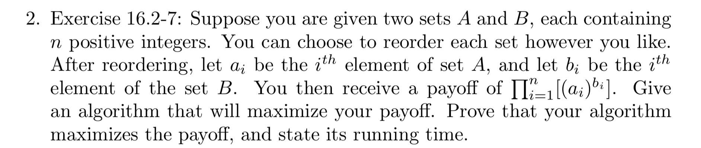
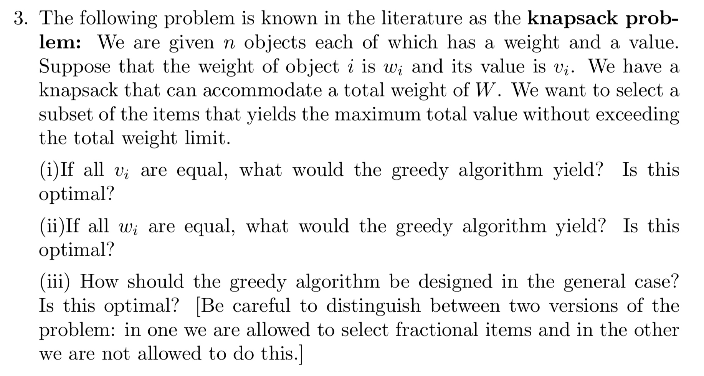

# Assignment 4
# Jiadao Zou --- jxz172230
## Q1
> 

- First, we could use logic deduction
    - $\forall$ pair $(m,n)$, there are totally three different situation:
        1. $G_1$, the set of pairs which have been asked and the adversary gave out "Yes" (exists an edge between the pair), already known.
        2. $G_2$, the set of pairs which have been asked and the adversary gave out "No" (no edge between the pair), already known.
        3. $G_3$, the set of pairs which have not been asked so we don't know whether they are connected, unknown.
- Second, the designer algorithms: 
    1. Partition V into two parts, set $V_1$ and set $V_2$.
    2. $\forall$ pair $(m,n)$, repeating:
        - If both $m,n$ in the same set, then we assume there is an edge between those two vertices.
        - Else, $m,n$ are not in the same set, assume there is no edge between them.
    3. Till out last question, "whether the end point in $V_1$ and the end point in $V_2$ are connected", we can't decide whether the graph is connected or not.
    
- Third, the adversary:
    - When the algorithms check if there is an edge between $m \ and \ n$:
        - Yes, if $(m,n)$ are connected and that is within $G_1$ (connected graph).
            -  The adversary will say the edge is not present.
        -  No, if $(m,n)$ are found to be not connected and there will be a cut.
            -  The adversary will say the edge is exists. And the designer knows in this case the graph $G$ is not connected and he needs to ask more questions.
        
    So we need to traverse all the cases ${{n(n-1)} \over 2}=O(n^2)$.
    
## Q2
> 

- We could sort A and B into monotonically increasing/decreasing order.
- Prove (Increasing Order):
    - Suppose we have indices $i, \ j$ that $i < j$. The corresponding a step of payoff is $(a_i)^{b_i}, \ (a_j)^{b_j}$.
    - Since A and B are monotonically increasing sorted, $a_i \leq a_j$ and $b_i \leq b_j$. Still those two sets only contain positive values, thus $a_i^{b_j-b_i} \leq a_j^{b_j-b_i} \Longrightarrow a_i^{b_j}a_j^{b_i} \leq a_i^{b_i}a_j^{b_j}$
    - We could see, this strategy give out a relatively larger $(a_i)^{b_i} (a_j)^{b_j}$ in each step.
- By the same idea, we could prove sorting in monotonically decreasing order gives out the same result.

## Q3
> 

- To avoiding exceeding the total load of Knapsack, we have to sort the items in increasing order of $W$. Then we only need to find the $k \ of \sum_{i=1}^kw_i \leq W$. For the fractional case, we have ${{W-\sum_{i=1}^kw_i}\over{w_{k+1}}}$ for case $k+1$. There would produce a greedy optimal solution for both of integral and fractional problem.
    - If the optimal solution has set $J$ and object $i$ which is not belongs to set $J$. If $J$ is $\emptyset$, then $J \cup O_i$ is contradicting the optimal set $J$. Else, we have $O_k \in J$, and let $J'=J\cup O_i \setminus O_k$. $J'$ is also optimal. Therefore, the greedy solution is optimal.
- Implement the algorithms in $O(n)$:
    - Referencing the previous question that:
        - Give $n$ elements $x_1,x_2...x_n$ with positive weights $w_1,w_2...w_n$, such that $\sum_{i=1}^nw_i=1$, the weighted lower median is the element $x_k$ that:
            $$\begin{aligned}
            \sum_{i:x_i<x_k}w_i &< {1 \over 2}       \\
            \sum_{i:x_i>x_k}w_i &\leq {1 \over 2}
            \end{aligned}$$
        - We want to get the weighted median in $\Theta(n)$.
    - Q(i):
        - We want our index k satisfying the relation, just like above:
            $$\begin{aligned}
            \sum_{i:w_i<w_k}w_i &\leq W      \\
            \sum_{i:w_i \leq w_k}w_i &> W
            \end{aligned}$$
        - Doing PARTITION on this element as the pivot to get the LOW side elements. Also, the fraction of this element is ${{W-\sum_{i \in LOW}w_i} \over {w_k}}$. This procedure is $\Theta(n)$ and produce the optimal solution.
    - Q(ii):
        - Sort the objects in decreasing order of $v_i$. Still we want to get $O_1,O_2...O_k$, where $k=\lfloor {W \over w} \rfloor$ for integer case and ${{W-kw} \over w}$ for fraction case of $O_{k+1}$.
        - The left is same with above question.
    - Q(iii): Algorithms design
        - First, sort objects in increasing order of $w_i \over v_i$.
            - Integer Case:
                - Starting with $O_1$ and include the next object if that is still within the limit. If not, just skip it and go to the next object.
                - This algorithms doesn't work for all the time. There is no greedy method for the optimal solution.
            - Fractional Case:
                - By using ${{W-\sum_{i=1}^kw_i}\over w_{k+1}}$ of $O_{k+1}$, there is an optimal solution.
                
    ## Q4:
    > 

- When $m=1$:
    - Let $P=p_1p_2...p_n$ be a permutation of {1,2...n} and let $s_i=t_{p_i}$. If customers are served in the order of P:
        $$\begin{aligned}
        \sum_{i=1}^nC_i &= s_1+(s_1+s_2)+...+(s_1+s_2+...+s_n)      \\
        &= \sum_{k=1}^n(n-k+1)s_k
        \end{aligned}$$
    This is minimized by permutation that $s_1 \leq s_2...\leq s_n$, the corresponding greedy algorithms is processing the customer with least time required first.
- When $m > 1$:
    - Just like above, for machine $\alpha$, we still have the same relationship:
         $$\begin{aligned}
        \sum_{i=1}^nC_i &= s_1+(s_1+s_2)+...+(s_1+s_2+...+s_{n_\alpha})      \\
        &= \sum_{k=1}^{n_\alpha}(n-k+1)s_k
        \end{aligned}$$
    - Still the same, to minimize $\sum_{i=1}^nC_i$, for all $m$ machines, we have to put the $m$ longest time required jobs, one job for one machine, at the end of each machine's schedule. The we put $m$ remaining longest time required jobs at the second end of all $m$ machines' schedule. And so on. Finally, if we have some slot for some machine, then just move all their schedule forward one step.
    
## Q3
> 

- Q(a):
    - $P_{j \neq i}= {p_j \over {1-p_i}}$
- Q(b):
    - No matter the sequence of $i$ and $j$, both cases are $P_{k \neq i, j}={p_k \over {1-p_i-p_j}}$.
- Q(c):
    - To maximize each step's benefit, we sort the box in increasing order of ${c_i \over p_i}$, and search from the low side to high.
    - Algorithms Complexity:
        - Assume we totally take {1...k} steps:
        $$\begin{aligned}
        Cost &= c_{(1)}+(1-p_{(1)})(c_{(2)}+(1-p_{not \ (1),(2)})(c_{(3)}+(1-p_{not \ (1),(2),(3)})...)      \\
        &= c_{(1)}+(1-p_{(1)})(c_{(2)}+(1-p_{(1)}-p_{(2)})(c_{(3)}+(1-p_{(1)}-p_{(2)}-p_{(3)})...)
        \end{aligned}$$
        The (i) is the $i$th step till we found the object. It is also $i$th smallest relatively cost of ${c_i \over p_i}$.
        - The equation seems like $n!$, since we have fewer and fewer choices after each step. The complexity is $\Theta(n!)=\Theta(n\lg n)$
        

    

