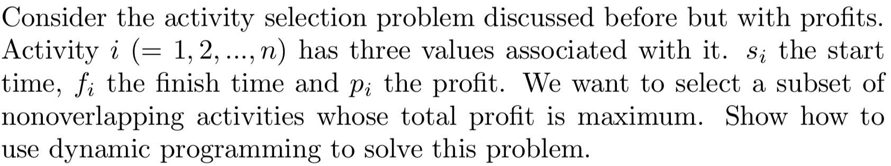
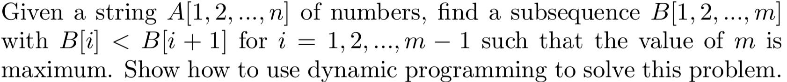
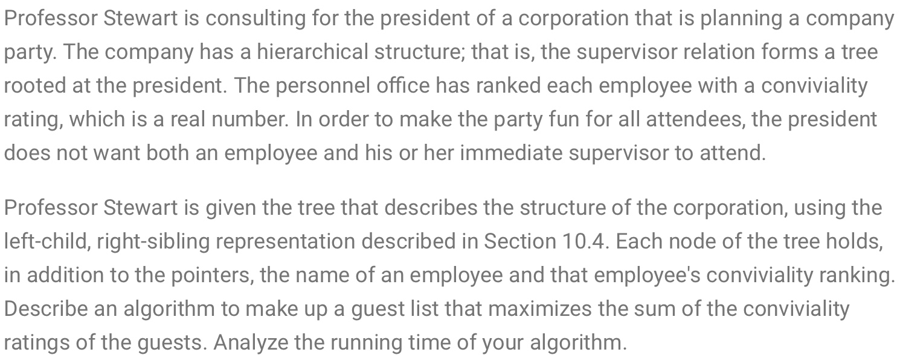
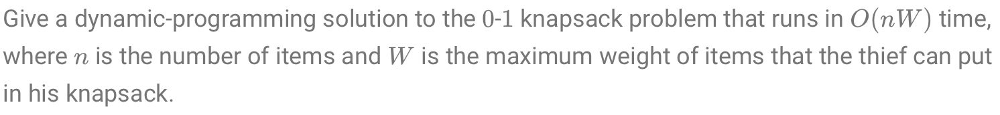
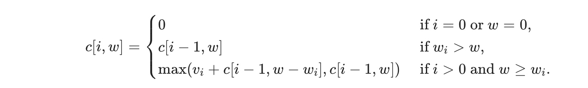
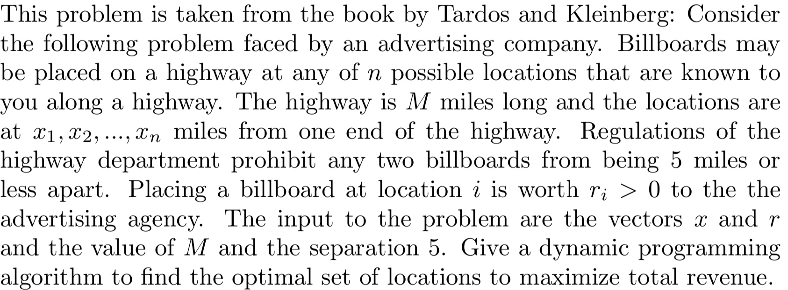

# Assignment 5
# Jiadao Zou --- jxz172230
## Q1
> 

First, let the $R[i]=\{j:s_j>s_i\}={i,i+1...n}$ for the increasing sorting set $s_i$, then we define an set $P$, with $P[i]$ is the maximum profit of $R[i]$.
1. Sort the activity set in $s_i$ values to fit the requirement of set $R$. Complexity: $\Theta(n \lg n)$
2. Also we suppose $N[i]=\min[j:s_j>f_i].$. Do binary search to find $N[i]$ by comparing each $f_i$ with the $s_i$ set. Complexity: $\Theta(n \cdot \lg n)$
3. Recursion process to update $P[j]$ by $P[i]$ from $n$th to the beginning.:
$$\begin{aligned}
P[n] &= p_n         \\ 
P[i] &= \max\{p_i+P[N[i]], P[i+1]\}, i<n
\end{aligned}$$Complexity: $\Theta(n)$
1. The overall complexity is $\Theta( n\lg n + n\lg n + n) = \Theta(n\lg n)$ 

## Q2
> 

- The question is asking us to finding the longest monotonically increasing subsequence of set $A$ and it call the length be $m$.
- Let $L[i]=$ the length of a longest increasing subsequence which ends in the element $A[i]$. Thus
    $$\begin{aligned}
    L[1] &= 1        \\
    L[j] &= \{1+ \max\limits_{i<j:A[i]<A[j]} L[i]\}, j \geq 2
    \end{aligned}$$
    
    ```js
   function LongestIncreasingSubsequence(A):
        n <- A.length
        for j <- 1 to n:
            do L[j] <- 1
            for i <- 1 to j-1
                do if A[i] < A[j] and 1 + L[i] > L[j]
                    then L[j] <- 1+L[i]
            return L
    ```
    The complexity is $\Theta(n^2)$.
    

## Q3, P15-6
> 

- If the root $r$ is included in an optimal solution, then dealing with the subproblem rooted at grandchildren of $r$. (root node is direct supervisor of his children node)
- If the root $r$ is excluded in an optimal solution, then dealing with the subproblem rooted at children of $r$.
- Algorithms:
    - Make a set $C$ indexed by vertices which tells us the optimal conviviality of a guest list obtained from the subtree with the root at that vertex. Also, create a set $G$ that $G[i]$ tells the guest list we use with root $i$. Let $T$ be the tree of guests. 
        - So, the problem begins with checking the $G[T.root]$ or $G[T.root.grandchildren]$.
        - Look at the leaf $L$, if the conviviality ranking at $L$ is positive, $G[L]={L}$ and $C[L]=L.con$.Otherwise $G[L]=\emptyset$ and $C[L]=0$. Iteratively solve the subproblems located at parents of nodes at which the subproblem has been solved. In general, for a node $x$:
        $$\begin{aligned}
        C[x] = \min (\sum\limits_{y \ is \ a \ child \ of \ x}C[y], \sum\limits_{y \ is \ a \ grandchild \ of \ x}C[y])
        \end{aligned}$$
        - Since $n$ is the number of leaves which is the number of subproblems. Solve each problem is in constant time, but the tree traversal to find the appropriate next node takes linear time. The complexity is $O(n^2)$ .

## Q4, P16.2-2
> 

- Let $i$ be the highest numbered item in an optimal solution $S$ for $W$ pounds and item $1...n$. Then $S'=S-{i}$ must be an optimal solution for $W-w_i$ pounds and items $1...i-1$, and the value of the solution $S$ is $v_i$ plus the value of the subproblem solution $S'$.
$c[i,w]$ is the value of solution for item $1...i$ and maximum weight $w$.Then

- The algorithms takes the maximum weight $W$ as the inputs, the number of item $n$, and two sequences $v={v_1,v_2...v_n}$ and $w={w_1,w_2...w_n}$. It stores the $c[i,j]$ values in $c[0..n, 0..W]$ whose entries are computed in row-major order. So, $c[n, W]$ is the maximum value:

    ```js
    function 01KNAPSACK(v,w,n,W)
        let c[0..n, 0..W] be a new array
        for w <- 0 to W
            c[0, w] = 0
        for i <- i to n
            c[i, 0] = 0
            for w <- 1 to W
                if w[i] ≤ w
                    if v[i] + c[i-1, w-w[i]] > c[i-1, w]
                        c[i, w] = v[i] + c[i-1, w-w[i]]
                    else c[i, w] = c[i-1, w]
                else c[i, w] = c[i-1, w]
    ```
- Time complexity:
    - $\Theta(nW)$ to fill in the $c$ table: $(n+1) \cdot (W+1)$ entries, each requiring $\Theta(1)$ to compute.
    - $O(n)$ to tracing from $n$th row and moves up one each step.

## Q5
> 

- For each $x_i$, we either put a bill board or not. If not, the problem reduced one size down. For each $x_i$, let $p(i)=\max\{j:x_j<x_i-5\}$. Time complexity is $\Theta(n)$.

```js
function FilterBySepearte(A, sep):
    // A index starts from 1 to n
    let n <- A.length
    let BottomArray, TopArray be new arrays
    for i <- 1 to A.length
        BottomArray[i] = A[1] + sep * (i-1)
        TopArray[n-i+1] = A[n] - seq * (i-1)
    for i <- 1 to A.length
        if A[i] ≤ BottomArray[i] or A[i] ≥ TopArray[i]
            drop A[i] 
```
- Let the total revenue be $P_i$ at $x_i$. The recursion is 
$$\begin{aligned}
R_0 &= 0; \ \ \ R_1 = r_1        \\
R_i &= \max[R_{i-1}, r_i+R_{p(i)}], \ i \geq 2 
\end{aligned}$$
- The time complexity is $O(n)$.