# Assignment 6
# Jiadao Zou --- jxz172230
## Q1
### 23.1-2
> 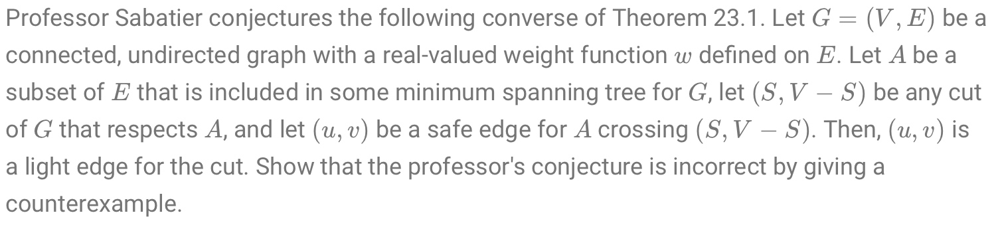

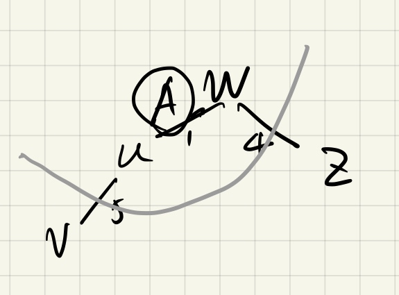
Suppose we have $w,u,z,v$ four vertices. 
- let edge $A=(u,w)$ be $S$, so $(u,w)$ respect the cut.
- Since the whole graph is a tree which itself could be a Minimum Spanning Tree, $(u,v)$ should be a safe edge. Moreover, every edge is safe over there.
- To the "light edge", obviously, the $(w,z)$ is smaller than $(u,v)$. So, the conjunction is False.

### 23.1-3 
> 

For the specific MST, after removing $(u,v)$ from it, we get two seperate tree $T_1,T_2$. 
- Suppose $(u,v)$ is not the light edge of some cut. Then, we could construct a new MST by using the light edge in this cut to connect $T_1$ and $T_2$. According to this, the new MST has smaller weight than the origin one, which contradicts the premise.

### 23.1-4
> 

We suppose $G$ has 3 vertices. Each vertex connects with two others and all the 3 edges share the same weight. 
- Obviously, every edge is a light edge since their weights are same. 
- But, if we containing such above light edge, we get a cycle but not a tree.

## Q2
## 23.2-8
> 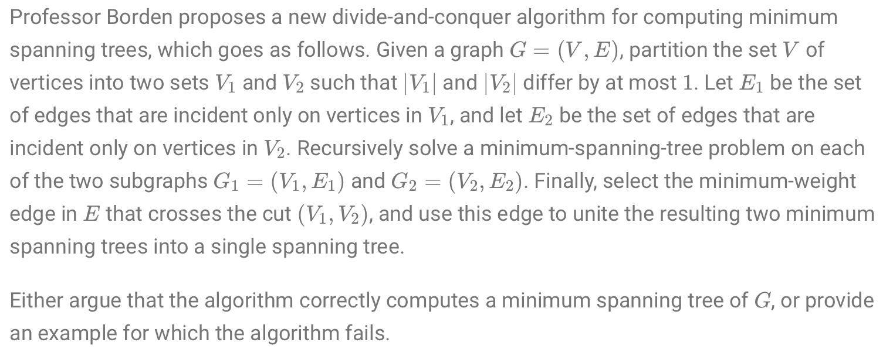

The algorithms fails.
- Since the partition is not well defined. Only makes difference of numbers of two sets be 1. So suppose we have a set $\{a,b,c\}$, where weight of $(a,b)=(a,c)=1$, and $(b,c)=5$. If the partition makes two sets $\{a\}$ and $\{b,c\}$.
- According to above algorithms, it won't give out the minimum spanning tree cause $(b,c)$ is in the result tree.

## Q3
## 23-4
> 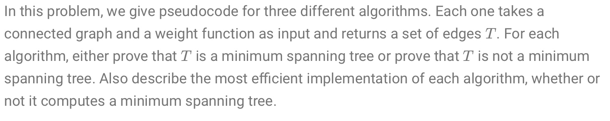
```js
function MAYBE-MST-A(G,w) 
    sort the edges into nonincreasing order of edge weight w
    T = E
    for each edge e, taken in nonincreasing order by weight w
        if T-{e} is a connected graph
            T = T-{e}
    return T
```
```js
function MAYBE-MST-B(G,w) 
    T = ∅
    for each edge e, taken in arbitrary order
        if T∪{e} has no cycles
            T = T∪{e}
    return T
```
```js
function MAYBE-MST-C(G,w) 
    T = ∅
    for each edge e, taken in arbitrary order
        T = T∪{e}
        if T∪{e} has a cycle c
            let e' be a maximum-weight edge on c
            T = T-{e'}
    return T
```

- (a) 
    - The algorithms return the MST because it is Kruskal's Algorithm B. The algorithm only remove the edge won't affect the tree's connection, which means it only remove edge of a cycle. While it remove edge in nonincreasing order, any of the other edges' weights would not larger than weight of the edge it removed.
    - To implement this algorithms, first we have to sort the edge in $O(E\lg E)$. Then for each edge, we use DFS to check whether $T-e$ is connected, that takes $O(|V|+|E|)$. The total cost would be $O(|E|^2)$ which will dominate the algorithms time complexity
- (b)
    - The algorithms will not return the MST because it doesn't arrange the weight in some order which could cause it discard lighter edge afterwards. For example, if we have $W_{(a,b)}=3, \ W_{(a,c)}=2, \ W_{(b,c)}=1$, then if the algorithms takes the edge in order of above sequence, it would dismiss $(b,c)$.
    - To implement this algorithms，just like Kruskal's Algorithms A, instead of replacing nondecreasing order to arbitrary order. Also, we have to keep a set recording current connected vertices. While the algorithms try to connect two components under same set would make a cycle. The time complexity is $O(|E|\alpha (|E|,|V|))$
- (c)
    - This algorithm works because it always try to remove the maximum weight in a cycle. The iteration would finally make a cycle becomes a tree. In some point, this algorithm serves like random version of Kruskal's algorithms B.
    - To implement this algorithms, just like question (b), except here it gonna find the maximum weight edge of a cycle. Using DFS in a cycle with $|V|$ vertices, it takes $O(|V|)$, because at that time, one cycle is the most this tree could have. So the time cost is $O(|E||V|)$.

## Q4
> 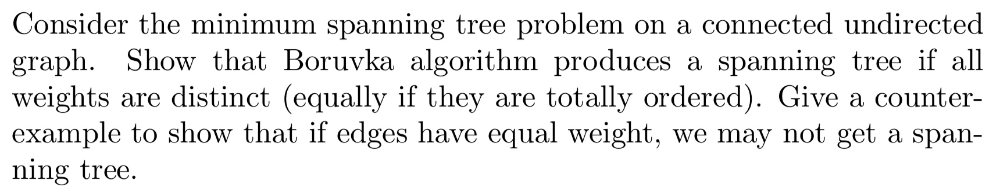

 ```js
 function Boruvka-Algorithms:
     Input: A graph G whose edges have distinct weights
     Initialize a forest F to be a set of one-vertex trees, one for each vertex of the graph.
     While F has more than one component:
       Find the connected components of F and label each vertex of G by its component
       Initialize the cheapest edge for each component to "None"
       For each edge uv of G:
         If u and v have different component labels:
           If uv is cheaper than the cheapest edge for the component of u:
             Set uv as the cheapest edge for the component of u
           If uv is cheaper than the cheapest edge for the component of v:
             Set uv as the cheapest edge for the component of v
       For each component whose cheapest edge is not "None":
         Add its cheapest edge to F
     Output: F is the minimum spanning forest of G.
 ``` 
 - To prove the correctness of Boruvka Algorithm:
     - 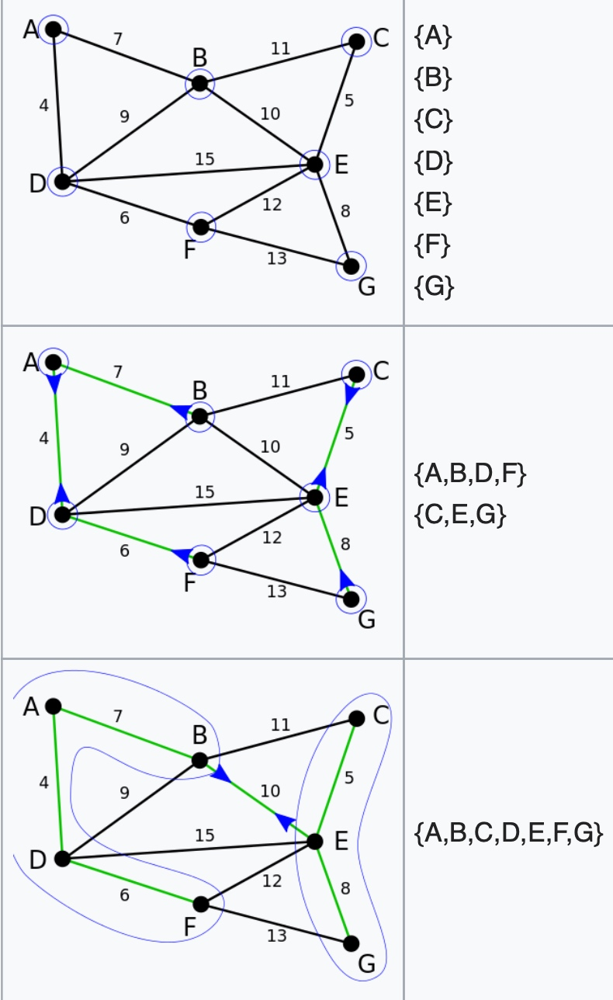
     - It looks like a divide-and-conquer version of Kruskal's Algorithms A, since each step, one component would connect to another one by the smallest weight edge if and only if those two components are disconnected. 
     - At the first step, the vertex would only extend one edge, the smallest weight one out.
     - At the following steps till the end, when components try to connect with others, they would only extend one edge between two components. So, suppose we have $n$ separate components, current step would only extend $n-1$ edges which is not enough for all the components connected while making a cycle. So, it won't generate any cycle when input is distinct edge.
 - Counter example when edge has equal weights:
     - When we have three vertices with three equally weighted edges, at step 1, each component would select a different edges to make a cycle.

## Q5
> 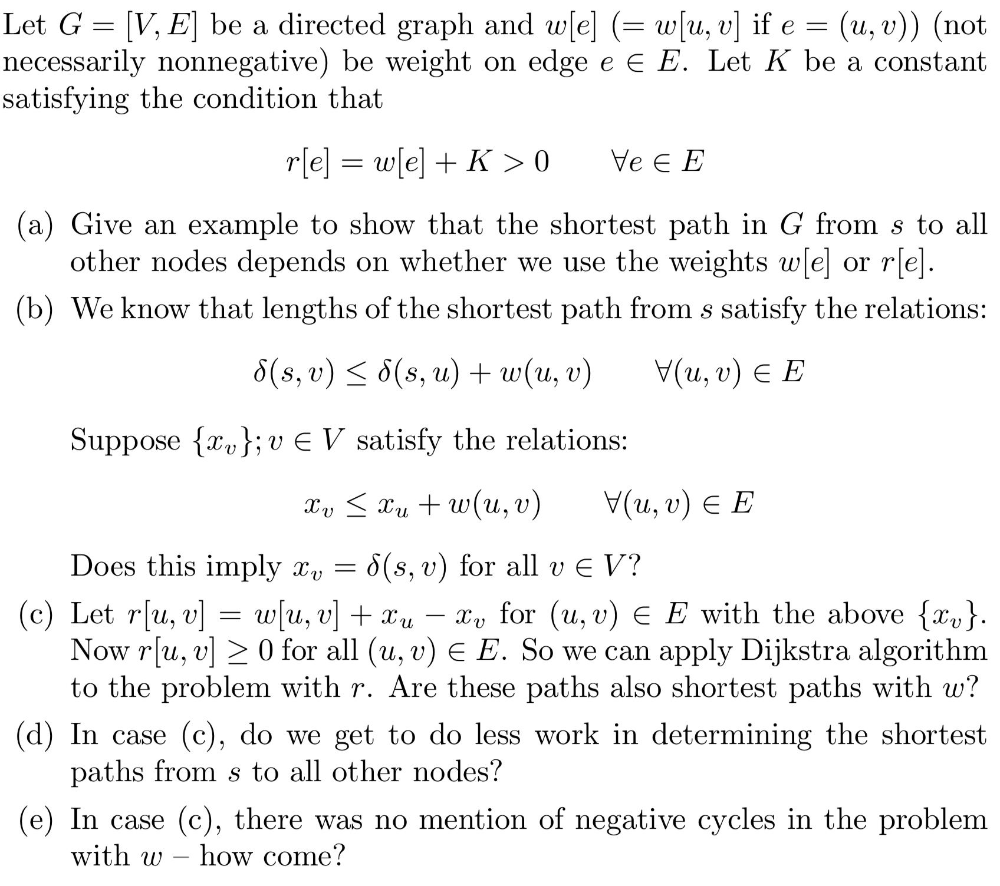
 
- (a)
    - 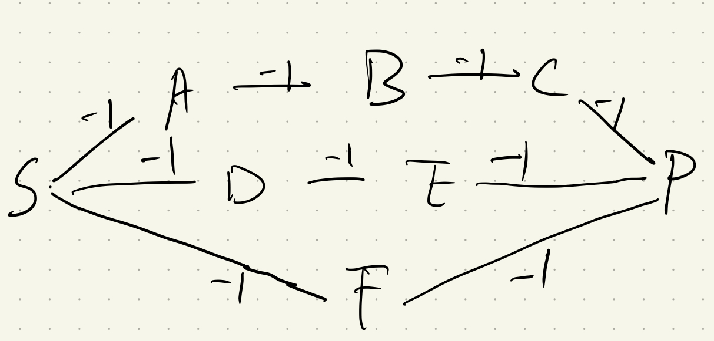
    - use $w[e]$, the shortest path is $S-A-B-C-P$
    - use $r[e]$:
        - when $K=1$, all the paths are same,$S-A-B-C-P=S-D-E-P=S-F-P$.
        - When $k>1$, shortest path is $S-F-P$.
- (b)
    - No. Since by the definition, we only know that $x_v-x_u \leq w(u,v)$. Though we suppose $\forall i \in V, x_i > 0$, we could only tells $x_v \leq w(u,v)$. So when $x_v \leq \min\limits_{u,v}(w(u,v))$, the equation always hold.
- (c)
    - Since from the definition, we know $r[u,v]=w(u,v)+x_u \geq x_v \geq 0$ is always increasing. So Dijkstra algorithm would works on this situation.
    - Suppose form starting vertex $S$ till ending vertex $P$, the shortest path of $r$ is: 
        $$\begin{aligned}
        Cost_r &= w(S,s_1)+x_S-x_{s_1}+w(s_1,s_2)+x_{s_1}-x_{s_2}+...+w(S_{n},P)+x_{s_{n}}-x_P \\
            &= \sum\limits_{i=S, j=s_1}^{i=s_n, j=P}w(i,j)+x_S-x_P
        \end{aligned}$$ As we could see, the cost of $r$ has nothing to do with r, so this shortest path could also be append to $w$.
- (d)
    - Dijkstra algorithm's time complexity is $O((|E|+|V|)\cdot \lg|V|)=O(|E| \cdot \lg |V|)$. Thus, if there is any other algorithms faster than that, we has a faster implements. Situation depends on $|E|$ and $|V|$.
- (e)
    - According to question (c), for any cycle: 
         $$\begin{aligned}
        Cost_{cycle} &= w(c_1,c_2)+x_{c_1}-x_{c_2}+w(c_2,c_3)+x_{c_2}-x_{c_3}+...+w(c_n,c_1)+x_{c_n}-x_{c_1} \\
            &= \sum\limits_{i,i+1 \in cycle}w(c_i,c_i+1)
        \end{aligned}$$ As long as $\forall w \geq 0$, we won't get a negative cycle.
        
## Q6
> 
    
- The augmented flow satisfies the flow conservation property. To a graph, flow into a vertex and out of a vertex can be viewed as two sums, $f$ and $f′$. If the parts are equally separated, their sums are also equal.
- The capacity constraint is not satisfied. Suppose we only have the vertices $s$ and $t$, and have a single edge from s to t of capacity 1. If there is a flow of value 1 from $s$ to $t$, however, augmenting this flow with itself ends up putting two units along the edge from $s$ to $t$, which is greater than the capacity we can send.
   
## Q7
### 26-1
> 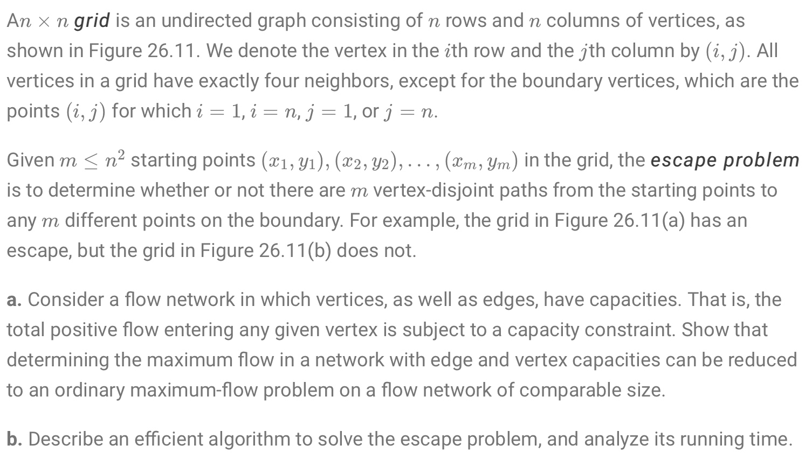
 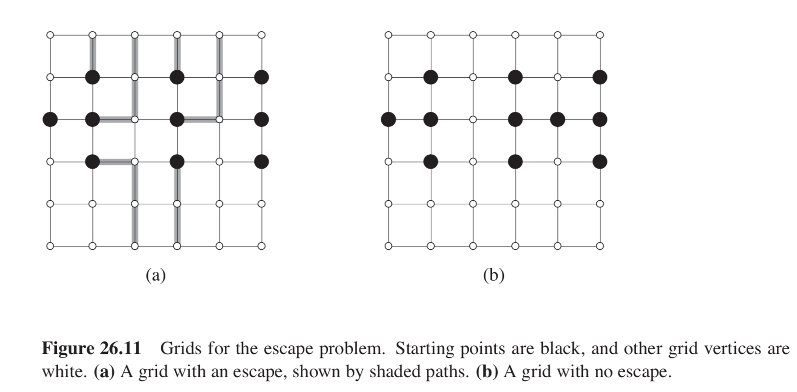

- (a)
    - We can capture the vertex constraints by splitting out each vertex into two, where the edge between the two vertices is the vertex capacity. This new flow network will have $2|V|$ vertices and have $|V |+|E|$ edges.
    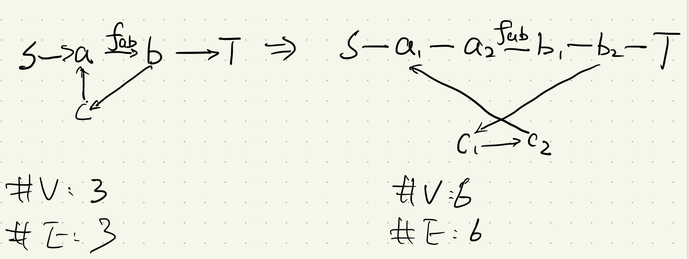
- (b)
    - For each intersection of grid lines, we construct a vertex with 1 capacity. And for each pair of adjacent vertices in the grid, we construct a bidirectional edge with 1 capacity. Then, put a unit capacity edge going from $s$ to each of the distinguished black vertices, and a unit capacity edge going from each vertex on the sides of the grid to $t$. 
    - Thus, we implement the idea of path taking because all of the augmenting paths will be a unit flow, and every edge has unit capacity. We would have the escaping paths if the total flow is equal to $m$. And, if the max flow is less than $m$, the escape path is not present, because otherwise we could construct a flow with value $m$ from it.
 
## Q8
### 26-4
> 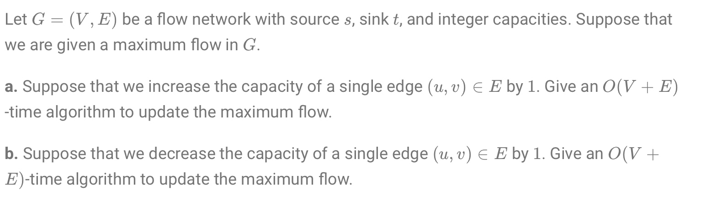

- (a)
    - If there exists a minimum cut on which $(u, v)$ doesn’t lie then the maximum flow can’t be increased. 
    - Otherwise it does cross a minimum cut, and we can possibly increase the flow by 1 by finding an augmenting path from $s$ to $t$ and increasing the edge capacity by 1. For that, we use a BFS, which runs in $O(|V| +|E|)$.
- (b)
    - If the edge’s flow was already at least 1 below capacity then nothing changes. 
    - Otherwise, find the path from $u$ to $v$ by BFS. Decrease this direction's flow by 1 and increasing opposite direction flow (from $v$ to $u$) by 1 to maintain the maximum flow.
    - As we have talked before, BFS takes $O(|V|+|E|)$ time.
